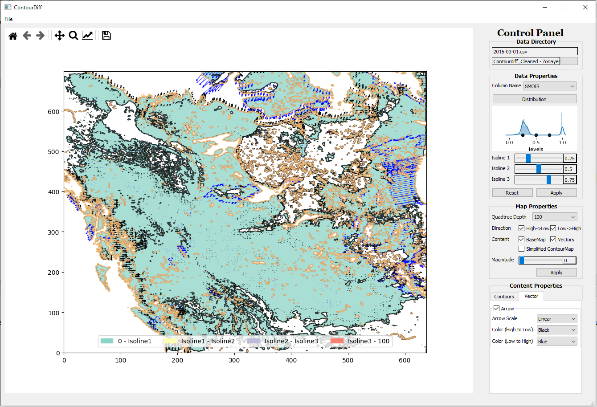

# ContourDiff_system

# Libraries used for Implementation
1. Pandas - 0.23.4: This module is used to create a dataframe from the input CSV files to do further analysis and computation.
2. Numpy - 1.15.4: This module is used to create 2-dimensional arrays from the dataframe and perform the required computation before plotting the resultant values as a figure.
3. Matplotlib - 3.0.2: This module is used to display figures from computation performed based on user input.
4. Shapely - 1.6.4: This module is used to create the polygons.
5. Scipy - 1.3.0: This module is used for polygon simplification.
6. PyQt5 - 5.13.0: This module is used to build the Graphical User Interface.
7. Scikit Image - 0.16.2: This module is used to read as well as processes RGB images into greyscale and transform them into matrices.
8. Time: This module is used to calculate the time and analyze time complexity of different functions of the process.
9. Seaborn 0.9.0 & This module is used to display the data distribution

# Dataset Description
1. We have used Weather Research and Forecasting (WRF) model output as a case study. WRF has been one of most used and steadily growing atmospheric model for research and numerical weather prediction with over 36,000 registered users and over 1,340 peer reviewed publications. The observed dataset contains data values related to 26 parameters from January 2013 to September 2015 over western Canada (latitude X longitude). As a case study for this research, we examine the following parameters: soil moisture (SMOIS), land surface temperature (TSK), and downward long wave flux at ground surface (GLW) using March 2013, March 2014 and March 2015 dataset to show trends. The dataset for each month used for this work has the size 639 X 699 with a resolution of 4km. Each dataset for a month has 446,662 rows and 29 columns. The dataset can be found in the following link: https://drive.google.com/drive/folders/1A0uBwRNloLJH-qFE8mlDPUqKuladIXpN?usp=sharing

2. We have also used image dataset to visualize the ice melting changes in a particualar location of Greenland. Two images portraying the ice melting of 1979 and 2002 have been added in the repository.

# Input Data Format
This code can take any number of input files (more than 1). For example, we want to show the change of trend in 3 years of data. So, we take three files of March 2013, March 2014 and March 2015. We suggest you unzip Datasets.zip and put it in the same directory. The WRF input files are in .csv format that holds values for different parameters in the whole temporal region. 

# Running Code and Genreating Images
1. Download the full repository using Git.
2. Open the whole project using Jetbrains - Pycharm. 
3. input_file_names: After unziping the dataset in the project folder, names of the input files need to be inserted from the UI.
column_name: In case of WRF input, there are 26 parameters in 26 columns in each .csv file included. So, name of one parameter needs to be inserted to visualize the trend of that geospatial variable. In case of image data, once you have inserted the images, a column name titled 'greyscale_values' will be generated in the system.
4. Code Description: 

   App_UI.py: This is the main application that takes command from the users and calls other files. 
   
   ProcessData.py: This portion of the code processes all the data to get it ready for visualization.
   
   MainCanvas.py: This portion visualizes trends for the data on top of a contourmap.
   
   DistributionCanvas.py: This portion takes a variable from the input data and shows the data distribution in UI.
   
   Quadtree.py: Quadtree part of the system has been implemented in this code.
   
5. Library Addition:
There are several libraries that needs to be inserted if you want to run the system. 
6. Sample Output: 
A sample output including the whole UI is shown below where we show changes the trends of change for 3 years of Soil Moisture data (three .csv files named '2013-03-01.csv', '2014-03-01.csv', '2015-03-01.csv').

<!-- -->
   
   

